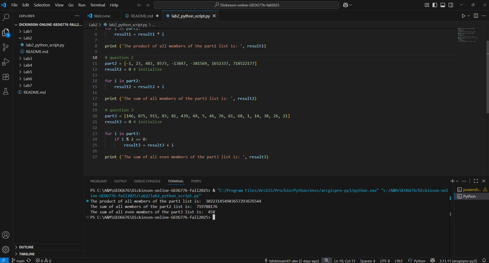

# Dickinson-online-GEOG776-fall2025
## GEOG 776 repo
### Question 1
** Take the following list and multiply all list items together. **

``` 
Solution for question 1
part1 = [1, 2, 4, 8, 16, 32, 64, 128, 256, 512, 1024, 2048, 4096]
result1 = 1 # initialize

for i in part1:
    result1 = result1 * i

print ('The product of all members of the part1 list is: ', result1)
```

### Question 2
** Take the following list and add all list items together. **

``` 
Solution for Question 2
part2 = [-1, 23, 483, 8573, -13847, -381569, 1652337, 718522177]
result2 = 0 # initialize

for i in part2:
    result2 = result2 + i

print ('The sum of all members of the part2 list is: ', result2)
```

### Question 3
** Take the following list and only add together those list items which are even. **

``` 
Solution for Question 3
part3 = [146, 875, 911, 83, 81, 439, 44, 5, 46, 76, 61, 68, 1, 14, 38, 26, 21] 
result3 = 0 # initialize

for i in part3:
    if i % 2 == 0:
        result3 = result3 + i

print ('The sum of all even members of the part3 list is: ', result3) 
```

### Output from script
