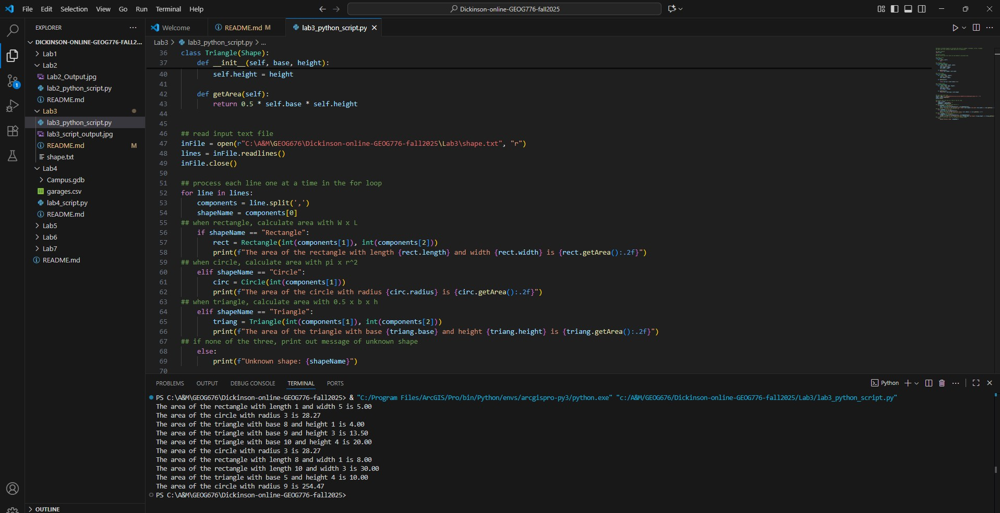

# Dickinson-Online-GEOG676-Fall2025
## GEOG 676 Lab 3

### Lab 3 requires 4 tasks to be completed

- Read data in from the provided text from the shape.txt file
- Create a class for each shape found in the text file 
- For each line, create a new object determined by the shape 
- Iterate through your list and print out the area for each shape 

#### The following screen capture shows the required output from the lab3_python_script.py:

