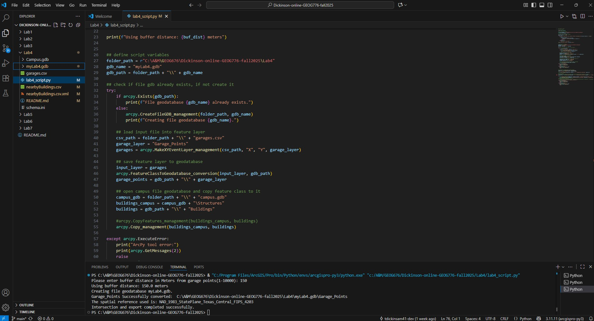

# Dickinson-Online-GEOG676-Fall2025
## GEOG 676 Lab 4

### Lab 4 requires 5 tasks to be completed:

1. Read in garage location X/Y coords from the provided .csv
1. Create a geodatabase and add in the input layers
1. Buffer the garage points
1. Intersect the buildings layer with the buffered garage points
1. Output the resulting table to a .csv

#### The following screen capture shows the output from the lab4_script.py:

