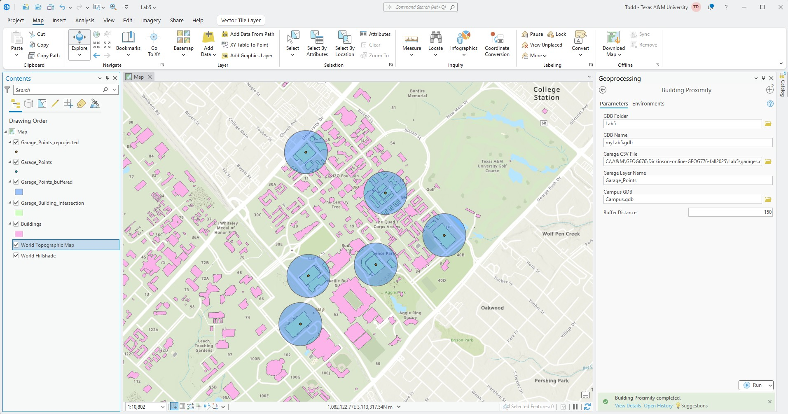

# Dickinson-Online-GEOG676-Fall2025
## GEOG 676 Lab 5

### Lab 5 requires the following tasks to be completed:

1. Turn the script created for Lab 4 into a tool
1. Add the tool into a toolbox
1. Demonstrate the tool in ArcGIS Pro and capture screenshot

#### The following screen capture shows teh output from the newly created tool along with its selection parameters:

