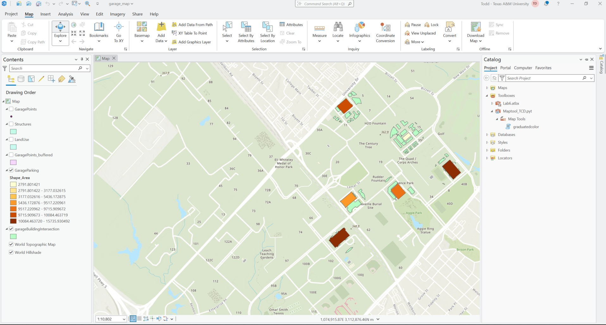

# Dickinson-Online-GEOG676-Fall2025
## GEOG 676 Lab 6

### Lab 6 requires the following tasks to be completed:

1. Create a script that can generate either a unique value or graduated color map
1. Turn said script into a toolbox that can be accessed from the Geoprocessing pane in ArcGIS Pro
1. Utilize a progressor inside the toolbox to inform the user how far along the script is in generating the map

#### The following screen capture shows the map from the new project created from the new graduatedcolor tool:

