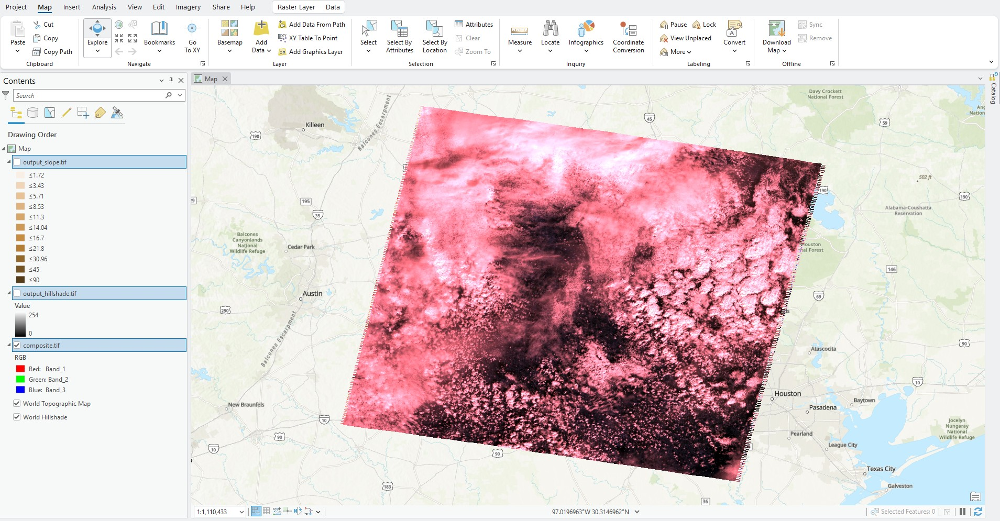
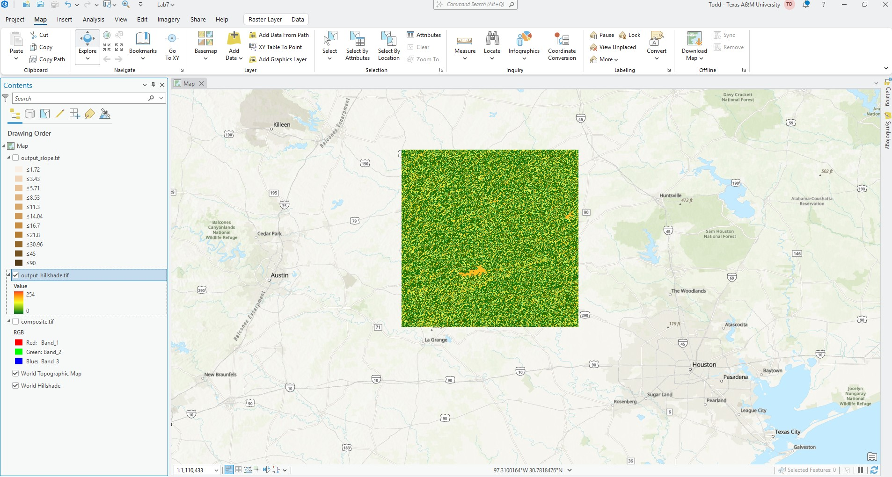
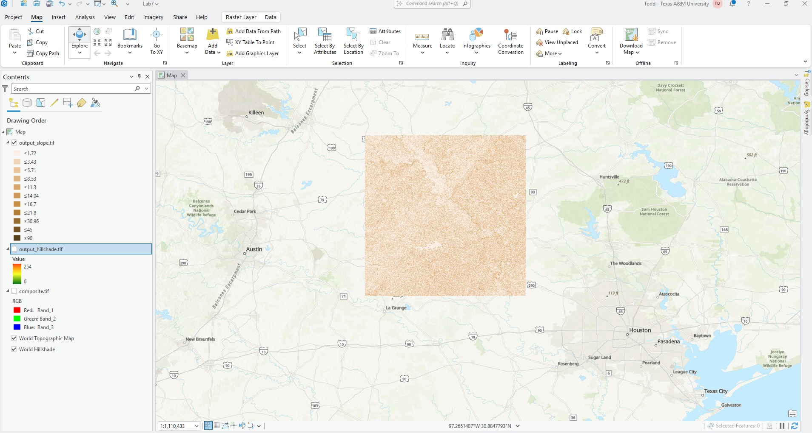

# Dickinson-Online-GEOG676-Fall2025
## GEOG 676 Lab 7

### Lab 7 requires the following tasks to be completed:

1. Find and download satellite imagery that is split up by band. Landsat is a great choice. Add the imagery to your Github.
1. Using the satellite imagery you downloaded, create a composite raster image
1. Find a digital elevation model of your area of interest and create the following:

    - A hillshade analysis raster
    - A slope analysis raster

#### Below, there are three screens shots. The first shows the composite image, the next shows
#### the hillshade analysis, and the last shows the slope analysis raster.

##### - images from USGS Earth Explorer

### Composite Screenshot

### Hillshade Screenshot

### Slope Screenshot
